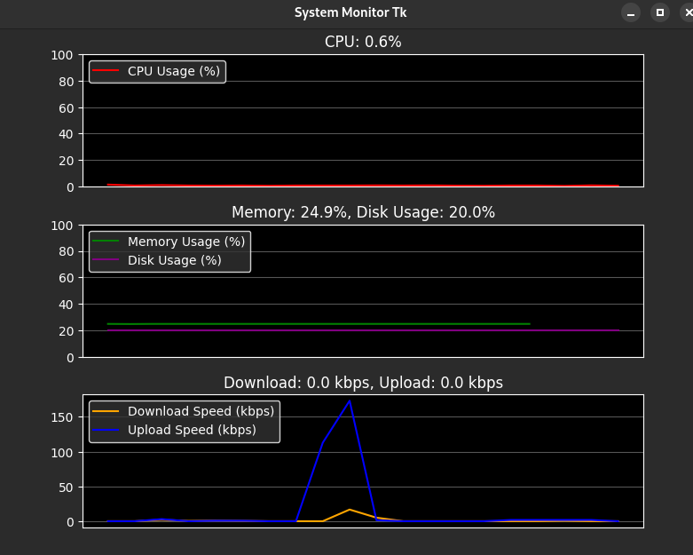
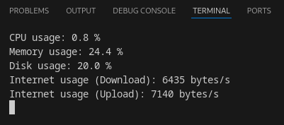

# System Monitor

Este projeto é um monitor de sistema para linux que exibe informações em tempo real sobre o uso de CPU, memória, disco e rede. Ele possui duas interfaces: uma interface gráfica construída com `Tkinter` e gráficos do `Matplotlib`, e uma interface de terminal para monitoramento direto no console.

## Funcionalidades

- **Monitoramento de CPU**
- **Monitoramento de Memória**
- **Monitoramento de Disco**
- **Monitoramento de Rede**

## Requisitos

- Python 3.6 ou superior
- Bibliotecas Python:
  - `psutil`
  - `tkinter`
  - `matplotlib`

## Como Usar

### Interface gráfica (GUI)

1. Certifique-se de que as dependências estão instaladas:
   ```bash
   pip install psutil matplotlib
2. Execute o script monitor_gui.py:
    ```bash
    python scripts/monitor_gui.py
### Interface de terminal

1. Basta executar:
    ```bash
    python scripts/terminal_monitor.py
## Capturas de tela

### Interface gráfica:



### Interface do terminal:


